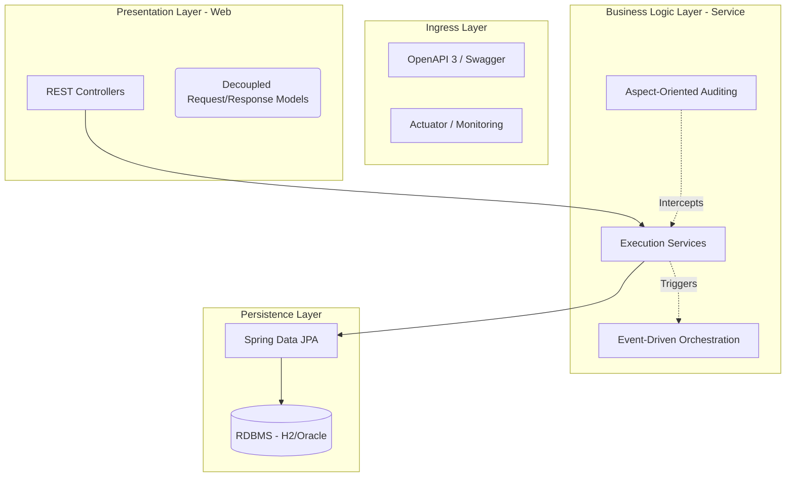
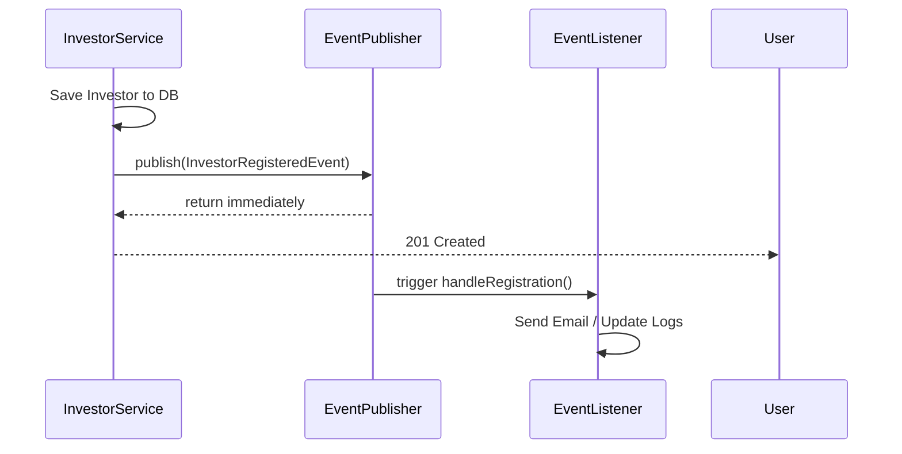

# Engineering Design Document: Mutual Fund Platform

## Table of Contents
1. [Executive Summary](#1-executive-summary)
2. [Problem Context & Design Goals](#2-problem-context--design-goals)
3. [High-Level Architecture](#3-high-level-architecture)
4. [Domain Modeling Decisions](#4-domain-modeling-decisions)
5. [DTO Standardization](#5-key-engineering-decision-dto-standardization)
6. [REST API Design Philosophy](#6-rest-api-design-philosophy)
7. [Data Access & Persistence](#7-data-access--persistence)
8. [Pattern Analysis: AOP & EDA](#8-pattern-analysis-aop--eda)
9. [Security Design: JWT & RBAC](#9-security-design-jwt--rbac)
10. [Testing Strategy](#10-testing-strategy)
11. [Evolution & Learnings](#11-evolution--learnings)
12. [Final Reflection](#12-final-reflection)

---

## 1. Executive Summary
- **Primary Goal**: Architect a production-grade, secure, and observable backend for mutual fund management.
- **Key Constraints**: High data integrity for capital weightage, stateless authentication, and decoupled side-effects.
- **Core Decisions**: Layered Architecture, Event-Driven Registration, AOP-based Auditing, and **Level 3 REST Maturity**.

This document details the architectural blueprint and engineering rationale for the Mutual Fund Management System. I designed the system to handle high-concurrency financial operations with a focus on **statelessness**, **auditability**, and **transactional integrity**. By bridging academic design principles with professional engineering practices, I deliver a platform that is both theoretically sound and practically resilient.

---

## 2. Problem Context & Design Goals
- **Domain Complexity**: Managing n-tier relationships between Investors, Portfolios, and weighted Stock compositions.
- **Architectural Fit**: A Layered Architecture was chosen to manage the cognitive load of these complex relationships.
- **Non-Functional Goals**: Prioritizing extensibility (adding new investment types) and testability (isolating business rules).

The domain of mutual fund management involves high-stakes data relationships. A single fund can contain dozens of stocks, each with a specific weightage that must sum to 100%. Investors, in turn, hold units of these funds. I identified that the primary engineering challenge was preventing "Anemic Domain Models" while ensuring that the business logic remained decoupled from the persistence and presentation layers.

### Why Layered Architecture?
I chose a layered approach because it provides clear separation of concerns. Each layer has a single, well-defined responsibility, which makes the system easier to test, maintain, and evolve. This is particularly important in a fintech context where regulatory requirements may necessitate rapid changes to business logic without impacting the data layer.

---

## 3. High-Level Architecture
- **Structure**: Formal N-Tier (Web, Service, Persistence).
- **Dependency Flow**: Unidirectional (Downwards).
- **Communication Pattern**: Synchronous for core transactions; Asynchronous for side-effects.

I implemented a strict **Model-View-Controller (MVC)** variant where each layer has a distinct, non-overlapping boundary. This ensures that a change in the database schema (Persistence Layer) does not necessitate a change in the API contract (Web Layer).



### Layer Responsibilities
1.  **Presentation Layer**: Responsible for HTTP entry points, input sanitization, and HATEOAS link generation.
2.  **Business Logic Layer**: The system's "brain." It coordinates transactions, enforces business constraints (e.g., wallet balance checks), and publishes events.
3.  **Persistence Layer**: Abstracts the database complexity using repositories, allowing me to swap the underlying storage engine with minimal friction.

---

## 4. Domain Modeling Decisions
- **Entity Identification**: Modeled around core financial primitives (Investment, MutualFund, Stock).
- **Relationship Integrity**: Using Join Entities for many-to-many relationships with state.
- **Composite Identity**: Identifying stock-in-fund mappings via composite keys.

I moved away from simple "Join Tables" to "Join Entities" (`StocksInFund`). This decision was critical because the relationship between a `MutualFund` and a `Stock` isn't just a link; it carries its own metadata—specifically `stockWeight` and `unit`. 

### Rationale for Composite Keys
By using a `StockIdentifier` composite key, I enforce database-level uniqueness. This prevents the "Double Entry" bug where a stock might accidentally be added to a fund's portfolio twice, which would invalidate NAV calculations.

---

## 5. Key Engineering Decision: DTO Standardization
- **Pattern**: Data Transfer Objects (DTO) for 100% of API egress.
- **Problem**: "Entity Leaking" and "N+1 Join" overhead.
- **Solution**: Decoupled Response models inheriting from `RepresentationModel`.

### The Problem: Entity Exposure
Exposing JPA entities directly to the API leads to **recursive serialization** and the **N+1 select problem**. Furthermore, it creates a tight coupling between the database schema and the public API.

```java
// DO NOT DO THIS: Tight coupling to DB schema
@GetMapping("/{id}")
public MutualFund getFund(@PathVariable int id) {
    return repo.findById(id).get(); 
    // Risky: Returns raw DB fields, exposes recursive relationships
}
```

### The Solution: 100% DTO Coverage
I implemented a strict DTO policy. This ensures that only relevant, non-sensitive data is transmitted to the client, and I can tailor the object structure for frontend convenience.

```java
// PREFERRED: Secured, Decoupled, and Extensible
public class MutualFundResponse extends RepresentationModel<MutualFundResponse> {
    private int fundId;
    private String fundName;
    private double currentNAV;
}
```

**Outcome**: Improved security, reduced JSON payload size, and elimination of hibernate-related serialization errors.

---

## 6. REST API Design Philosophy
- **Resource Modeling**: Singular/Plural consistency across all URIs.
- **Status Semantics**: Strict adherence to RFC 7231 (e.g., 201 Created for POST, 403 Forbidden for RBAC violations).
- **Maturity**: Achieving **Level 3 (HATEOAS)**.

I modeled the API around **Resources**, not actions. Instead of `/getFund`, I use `GET /mutualfunds/{id}`. This makes the API intuitive and compatible with generic REST clients.

### HATEOAS Implementation
For every resource fetched, the server provides links to related operations. This reduces "URL Knowledge" required by the frontend.

```json
{
  "fundId": 101,
  "fundName": "Equity Alpha",
  "_links": {
    "self": { "href": "http://localhost:8188/mutualfunds/id/101" },
    "stocks": { "href": "http://localhost:8188/mutualfund/getstockweights/101" }
  }
}
```

---

## 7. Data Access & Persistence
- **Abstraction**: Spring Data JPA for interface-driven repository creation.
- **Transaction Boundaries**: Declared at the Service layer to ensure "All-or-Nothing" operations.
- **Performance Trade-offs**: Using Lazy-loading as defaults to prevent fetching entire graphs on simple queries.

I chose to define `@Transactional` boundaries at the Service level. This is vital in a fintech context where a "Buy" operation involves updating the Investor's wallet, creating an Investment record, and recalculating Fund metrics. If any part of this fails, the entire transaction is rolled back, preventing orphaned records.

---

## 8. Pattern Analysis: AOP & EDA

### A) Non-Intrusive Auditing via AOP
I use Aspect-Oriented Programming (AOP) to handle cross-cutting concerns like logging and performance tracking.

```java
@Aspect
@Component
public class LoggingAspect {
    @Around("@annotation(logActivity)")
    public Object logActivityDetails(ProceedingJoinPoint joinPoint, LogActivity logActivity) throws Throwable {
        long start = System.currentTimeMillis();
        try {
            Object result = joinPoint.proceed();
            logger.info("ACTIVITY: {} completed in {} ms", logActivity.value(), (System.currentTimeMillis() - start));
            return result;
        } catch (Throwable e) {
            logger.error("FAILED: {} - error: {}", logActivity.value(), e.getMessage());
            throw e;
        }
    }
}
```
**Rationale**: Business logic (e.g., `executeTransaction()`) remains "clean" while the system automatically records performance metrics and audit trails.

### B) Event-Driven Orchestration (EDA)
High-latency side-effects (like registration welcome emails) are decoupled using the **Observer Pattern** (Spring Events).



**Rationale**: By offloading these tasks to a background thread, I maintain sub-200ms API response times for the users.

---

## 9. Security Design: JWT & RBAC

### Overview
- **Authentication**: Stateless JWT with HS512 signing.
- **Authorization**: Role-Based Access Control (RBAC) enforced at the filter and method levels.
- **Threat Model**: Prevents CSRF (no cookies), Replay Attacks (short expiry), and data tampering (signed payloads).

I chose a **stateless architecture** because it is horizontally scalable. There is no server-side session to replicate across instances. The JWT token contains all the information needed to verify the user's identity and their granted authorities.

### RBAC Implementation Deep-Dive

I implemented RBAC to enforce the principle of least privilege. The system defines two primary roles:

| Role | Description | Example Permissions |
|------|-------------|---------------------|
| `ROLE_USER` | Standard investor. | View funds, make investments, view own portfolio. |
| `ROLE_ADMIN` | Portfolio Manager or System Admin. | All `ROLE_USER` permissions + create funds, add stocks, manage users. |

#### How Roles Are Assigned
Upon registration, an investor is assigned the `ROLE_USER` role by default. This role is stored in the `Investor` entity and loaded by the `JwtUserDetailsService` during authentication.

```java
// In JwtUserDetailsService.java
@Override
public UserDetails loadUserByUsername(String email) throws UsernameNotFoundException {
    Investor investor = investorRepository.findByEmail(email);
    // The role from the database is converted to a GrantedAuthority
    return new User(investor.getEmail(), investor.getPassword(),
            Collections.singletonList(new SimpleGrantedAuthority(investor.getRole())));
}
```

#### How Roles Are Enforced
I enforce authorization at two levels for defense-in-depth:

**1. URL-Level Security (Coarse-Grained)**
In `WebSecurityConfig.java`, I define which URL patterns require which roles. This is the first line of defense.

```java
// WebSecurityConfig.java
.authorizeRequests()
    // Public endpoints
    .antMatchers("/authenticate", "/register", "/swagger-ui/**", "/actuator/**").permitAll()
    // Admin-only endpoints
    .antMatchers("/stocks/add", "/mutualfund/add", "/portfoliomanagers/add").hasRole("ADMIN")
    // All other endpoints require authentication
    .anyRequest().authenticated()
```

**2. Method-Level Security (Fine-Grained)**
For more granular control, I use `@PreAuthorize` annotations on controller methods. This is enabled by `@EnableGlobalMethodSecurity(prePostEnabled = true)`.

```java
// Example in a Controller
@PreAuthorize("hasRole('ADMIN')")
@PostMapping("/add")
public ResponseEntity<MutualFund> createFund(@RequestBody MutualFundRequest request) {
    // Only reachable by ADMIN users
}
```

#### Request Flow Diagram

```mermaid
flowchart TD
    A[Client Request] --> B{Has JWT Token?}
    B -- No --> C[Return 401 Unauthorized]
    B -- Yes --> D[JwtRequestFilter: Validate Token]
    D -- Invalid --> C
    D -- Valid --> E[Extract User + Roles]
    E --> F{URL Matches Config?}
    F -- "/admin/*" --> G{User has ROLE_ADMIN?}
    G -- No --> H[Return 403 Forbidden]
    G -- Yes --> I[Proceed to Controller]
    F -- "Other Protected" --> J{User is Authenticated?}
    J -- No --> C
    J -- Yes --> I
    I --> K[Controller Method]
    K --> L{@PreAuthorize Check?}
    L -- Fails --> H
    L -- Passes --> M[Execute Business Logic]
```

### Benefits of This RBAC Design
1.  **Security**: Prevents unauthorized access to sensitive financial operations like creating funds.
2.  **Maintainability**: Adding a new role (e.g., `ROLE_AUDITOR`) only requires updating the configuration, not the core business logic.
3.  **Clarity**: The security contract is explicit and can be audited by reading `WebSecurityConfig.java`.
4.  **Testability**: I can easily write integration tests that simulate different user roles and verify access control.

---

## 10. Testing Strategy
- **Philosophy**: Behavioral coverage > Line coverage.
- **Unit Testing**: Isolated service logic using Mockito.
- **Integration Testing**: End-to-end verification using `MockMvc` and H2.

I intentionally avoid testing third-party libraries (like Spring Data JPA methods). Instead, my tests focus on the **Business Contracts**—verifying that the correct events are published and the correct status codes are returned when constraints are violated.

---

## 11. Evolution & Learnings
- **The "Dependency Hell" Refactor**: Migrating from legacy Springfox to modern Springdoc OpenAPI 3.
- **Learning**: Maintaining architectural maturity (like HATEOAS) often introduces versioning conflicts with older documentation libraries. I learned that pivoting to modern standards early is superior to patching legacy systems.

---

## 12. Final Reflection
This system is engineered for **maintenance** and **clarity**. By adhering to the principles of separation of concerns and adopting enterprise patterns like AOP and EDA, I have built a platform that sits at the intersection of academic rigor and professional practice.


**Ayush Varma**  
MS Computer Science, Northeastern University  
[GitHub](https://github.com/ayushvarma7) | [LinkedIn](https://linkedin.com/in/ayushvarma7) | [Portfolio](https://ayushvarma7.github.io)