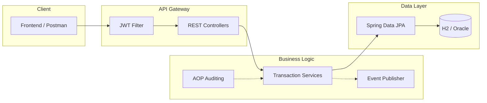

# Mutual Fund Management System 📈

A production-ready fintech backend built with **Spring Boot 2.7**, engineered for scalability, auditability, and secure asset management. This platform models a complete investment lifecycle—from dynamic NAV calculation to secure multi-role transactions.


> 📖 **[Engineering Design Deep-Dive →](DESIGN.md)** — Architectural rationale, design patterns, RBAC implementation, and performance optimizations.

---

## 📋 Platform Capabilities

| Feature | Implementation | Benefit |
|---------|----------------|---------|
| **Secure Transactions** | JWT + RBAC | Role-based access for Investors vs Admins |
| **Async Orchestration** | Event-Driven Architecture | Non-blocking registration & notifications |
| **Auditing** | AOP (Aspect-Oriented) | Automatic logging without code clutter |
| **API Discoverability** | HATEOAS (Level 3 REST) | Self-documenting hypermedia links |
| **Observability** | Spring Actuator | Real-time health, metrics, and info |

---

## 🏛️ Architecture Overview



---

## 📁 Project Structure

```
src/main/java/com/project/
├── aspect/            # AOP: @LogActivity annotation & LoggingAspect
├── controller/        # REST endpoints (HATEOAS-enabled)
├── dto/               # Request/Response models (decoupled from entities)
├── event/             # Event-Driven: InvestorRegisteredEvent, Listeners
├── model/             # JPA Entities: Investor, MutualFund, Stock, Investment
├── repository/        # Spring Data JPA interfaces
├── security/          # JWT Filter, WebSecurityConfig, RBAC
└── service/           # Business logic & transaction management
```

---

## 🏗️ Technical Stack

| Layer | Technology |
|-------|------------|
| **Core** | Java 17, Spring Boot 2.7, Spring Data JPA |
| **Security** | Spring Security, JWT (JJWT), BCrypt |
| **API Maturity** | Spring HATEOAS, Springdoc OpenAPI 3 |
| **Monitoring** | Spring Boot Actuator |
| **Database** | H2 (Dev), Oracle SQL (Production) |
| **Testing** | JUnit 5, Mockito, MockMvc |

---

## 🚀 Installation & Setup

### Prerequisites
- **JDK 17** or higher
- **Maven 3.6+** (or use included wrapper)
- (Optional) **Postman** for API testing

### 1. Clone & Build
```bash
git clone https://github.com/ayushvarma7/Mutual_Fund_Project.git
cd Mutual_Fund_Project

# Build using the local Maven wrapper
./.maven_local/bin/mvn clean compile
```

### 2. Run the Application
```bash
./.maven_local/bin/mvn spring-boot:run
```
The server starts on **port 8188**.

### 3. Run Tests
```bash
./.maven_local/bin/mvn test
```

---

## ⚡ Quick Demo (60 Seconds)

**1. Register a new investor:**
```bash
curl -X POST http://localhost:8188/register \
  -H "Content-Type: application/json" \
  -d '{"firstName":"John","lastName":"Doe","email":"john@example.com","password":"secure123","contactNumber":"1234567890"}'
```

**2. Authenticate to get JWT:**
```bash
curl -X POST http://localhost:8188/authenticate \
  -H "Content-Type: application/json" \
  -d '{"username":"john@example.com","password":"secure123"}'
```

**3. Use the JWT to access protected endpoints:**
```bash
curl http://localhost:8188/mutualfunds \
  -H "Authorization: Bearer <YOUR_JWT_TOKEN>"
```

---


## 🧪 Mock Data & Demo (Auto-Seeded)

The application automatically seeds a realistic dataset on startup using `JavaFaker`, so you can test features immediately without manual entry.

### Pre-configured Users
| Role | Email | Password |
|------|-------|----------|
| **Admin** | `admin@example.com` | `password` |
| **User** | `user@example.com` | `password` |

### Seeded Entities
- **5 Portfolio Managers** with randomized profiles
- **20 Stocks** (NASDAQ tickers) with historical price data
- **10 Mutual Funds** with assets, NAV, and manager assignments
- **Assets Composition** for each fund (randomized stocks and weights)
- **10 Investors** with diverse portfolios
- **Multiple Investments** per investor (Buy/SIP history)

---

## 📚 API Reference

### 🔐 Authentication
| Method | Endpoint | Description |
|--------|----------|-------------|
| POST | `/register` | Register a new investor |
| POST | `/authenticate` | Login and receive JWT |

### 📊 Mutual Funds
| Method | Endpoint | Description | Auth |
|--------|----------|-------------|------|
| GET | `/mutualfunds` | List all funds | **Guest** |
| GET | `/mutualfunds/id/{id}` | Get fund details (HATEOAS) | **Guest** |
| POST | `/mutualfund/add` | Create a new fund | **Admin** |
| GET | `/mutualfund/getstockweights/{id}` | Get stock composition | **Guest** |
| GET | `/investor/mfs/{investorId}` | Invested funds history | User |

### 💰 Investments
| Method | Endpoint | Description | Auth |
|--------|----------|-------------|------|
| GET | `/investments` | List all investments | User |
| POST | `/investments/add` | Record a new investment | User |
| GET | `/investments/id/{investorId}` | Get investor's portfolio | User |

### 📈 Stocks
| Method | Endpoint | Description | Auth |
|--------|----------|-------------|------|
| GET | `/stocks` | List all stocks | **Guest** |
| POST | `/stocks/add` | Add a new stock | **Admin** |

---

## 🍱 Developer Tooling

| Endpoint | Purpose |
|----------|---------|
| `/swagger-ui.html` | Interactive API Documentation |
| `/v3/api-docs` | OpenAPI 3 Metadata (JSON) |
| `/actuator/health` | Real-time System Heartbeat |
| `/actuator/info` | Application Metadata |
| `/h2-console` | In-memory Database Console |

---

## 🛠️ Design Highlights

- **Statelessness**: No server-side sessions; horizontally scalable.
- **Fail-Fast Validation**: DTOs validate input before reaching business logic.
- **Audit Trails**: AOP intercepts every transaction for accountability.
- **Event Decoupling**: Registration side-effects (email, logs) run asynchronously.

> For a complete explanation of these design choices, see the **[DESIGN.md](DESIGN.md)**.

---

## 👨‍💻 Author

**Ayush Varma**  
MS Computer Science, Northeastern University  
[GitHub](https://github.com/ayushvarma7) | [LinkedIn](https://linkedin.com/in/ayushvarma7) | [Portfolio](https://ayushvarma7.github.io)
